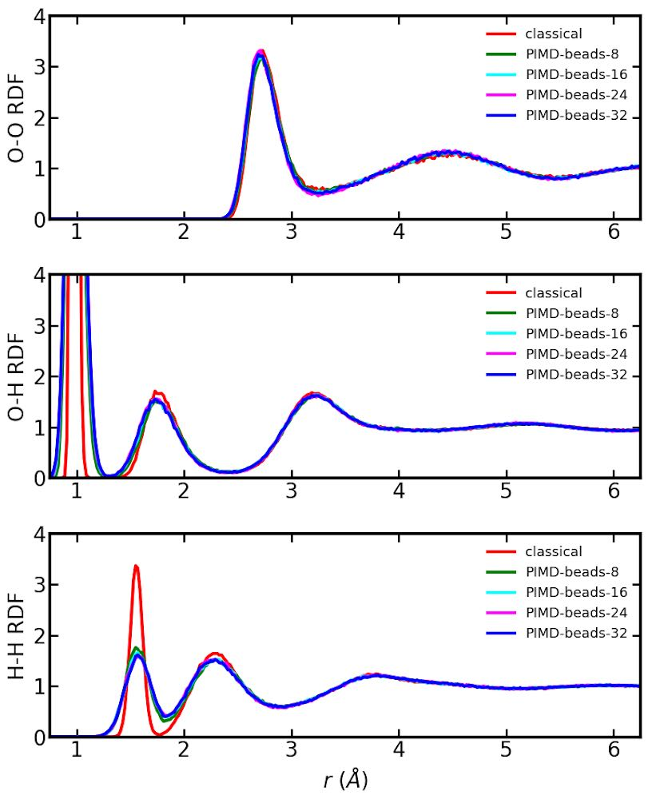

# 《分子动力学模拟入门》第六章：路径积分分子动力学

本章介绍几个常用的路径积分分子动力学模拟方法。

# Table of contents
- [量子力学基础](#量子力学基础)
- [路径积分分子动力学基础](#路径积分分子动力学基础)
  - [量子-经典对应](#量子-经典对应)
  - [路径积分分子动力学的概念](#路径积分分子动力学的概念)
  - [RPMD的概念](#RPMD的概念)
  - [CMD的概念](#CPMD的概念)
- [路径积分分子动力学的算法](#路径积分分子动力学的算法)
- [基本物理量的计算](#基本物理量的计算)
  - [势能的计算](#势能的计算)
  - [动能的计算](#动能的计算)
  - [位力的计算](#位力的计算)
  - [热流的计算](#热流的计算)
- [路径积分分子动力学的应用](#路径积分分子动力学的应用)
  - [晶体的热熔](#晶体的热熔)
  - [晶体的热膨胀](#晶体的热膨胀)
  - [水的结构性质](#水的结构性质)

## 量子力学基础

待写。快速过渡到 Feynman 路径积分量子力学。

## 路径积分分子动力学基础

### 量子-经典对应

讨论 Chandler 和 Wolynes 1981 年 的工作。

### 路径积分分子动力学的概念

讨论 Parrinello 和 Rahman 1984 年的工作。

### RPMD 的概念

[Craig 和 Manolopoulos](https://doi.org/10.1063/1.1777575) 于2004 提出了 ring-polymer MD （RPMD).

### CMD 的概念

[Jianshu Cao 和 Gregory A. Voth](https://doi.org/10.1063/1.467175) 于 1994 提出 centroid MD (CMD).

（但本书可能不打算针对 CMD 编程）

## 路径积分分子动力学的算法

首先讲 Ceriotti 等人针对PIMD的 PILE (path integral Langevin equation)。然后讲RPMD 以及 TRPMD (thermostatted RPMD) 的实现。这里要重点介绍 Korol 等人的 Cayley 变换。

用简谐振子为例编程实现。MATLAB 即可。

## 基本物理量的计算

### 势能的计算
### 动能的计算

### 位力的计算
### 热流的计算

## 路径积分分子动力学的应用

### 晶体的热熔

简写振子的能量。

### 晶体的热膨胀

### 水的结构性质

用公开的 [NEP 势](https://gitlab.com/brucefan1983/nep-data) 计算水的径向分布函数，结果如下图所示。

